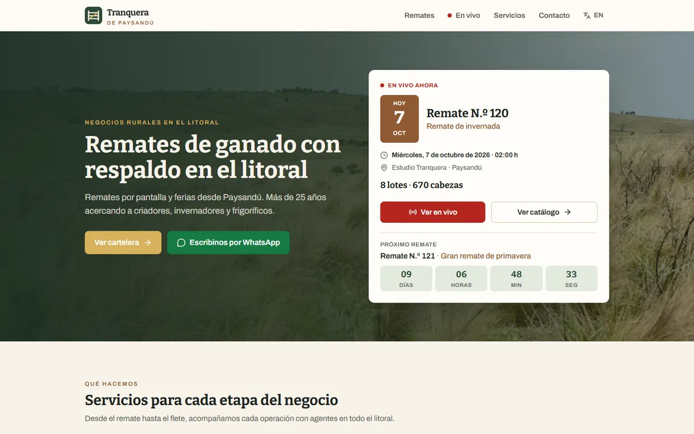
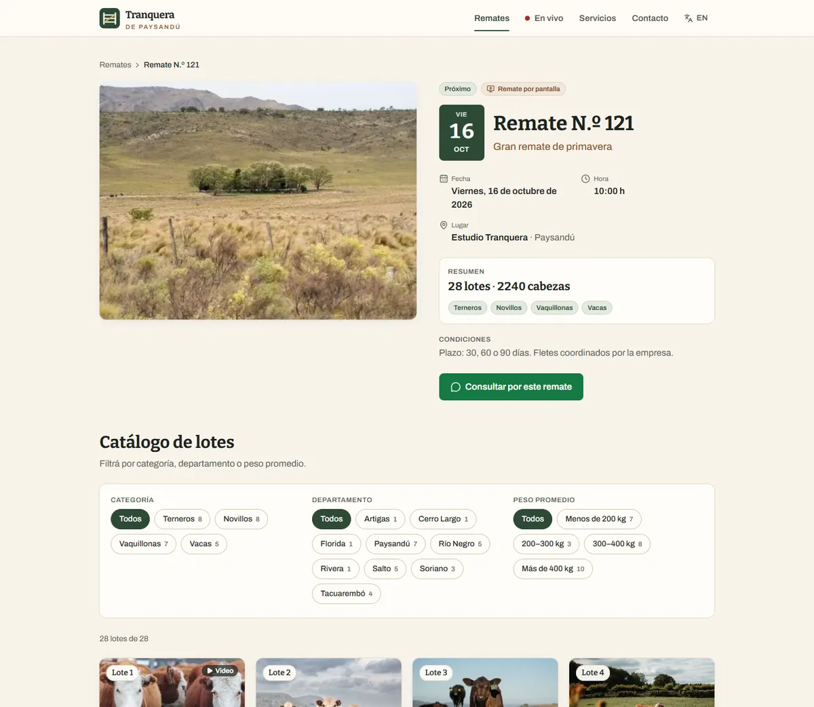
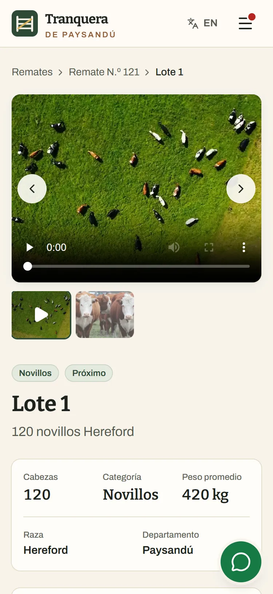
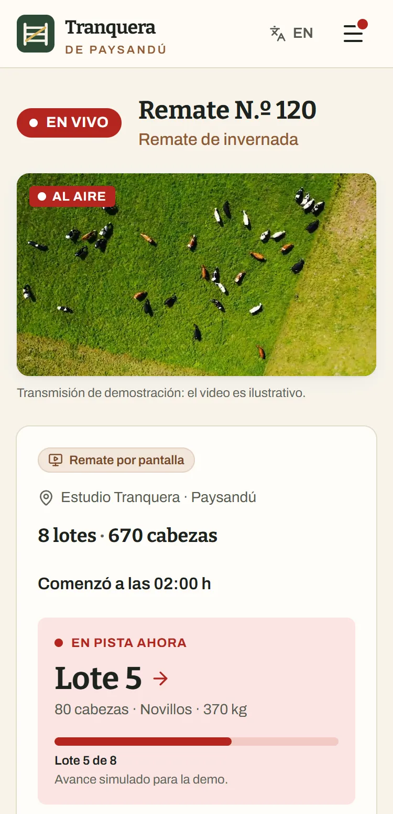

# Tranquera de Paysandú

Bilingual (es/en) website for a fictional Uruguayan cattle auction company, built with Next.js 16
and Supabase.

**Live demo: https://tranquera-de-paysandu.vercel.app**

**EN** · Portfolio project: a public site for a cattle auction house in Paysandú, Uruguay, that
runs screen auctions and saleyard fairs. Visitors browse the auction schedule, filter a lot catalog
by category, department and weight, open a lot page with photos, video, map and a direct WhatsApp
line to the agent, and follow an always-on live auction. It is fully translated, including
URLs and sample content. The data lives in Postgres, with caching that keeps pages up even when
the database is down. The company, people and lots are fictional; the site is inspired by
Uruguayan livestock auction websites.

**ES** · Proyecto de portfolio: sitio público de una rematadora de ganado de Paysandú, Uruguay,
que hace remates por pantalla y ferias. Permite recorrer la cartelera de remates, filtrar el
catálogo de lotes por categoría, departamento y peso, abrir la ficha de cada lote con fotos, video,
mapa y contacto directo por WhatsApp con el agente, y seguir un remate en vivo que siempre está al
aire. Está traducido por completo, incluidas las URLs y el contenido de ejemplo. Los datos están
en Postgres, con una caché que mantiene las páginas en pie aunque la base no responda. La empresa,
las personas y los lotes son ficticios; el sitio se inspiró en sitios de rematadoras uruguayas.

| Home (desktop)                                                             | Auction catalog (desktop)                                                  |
| -------------------------------------------------------------------------- | -------------------------------------------------------------------------- |
|  |  |

| Lot page (phone)                                                                                              | Live auction (phone)                                                                                               |
| ------------------------------------------------------------------------------------------------------------- | ------------------------------------------------------------------------------------------------------------------ |
|  |  |

## Features

- **Auction schedule** with upcoming and finished tabs and a type filter. A featured auction on the
  home page with a countdown to the next one.
- **Lot catalog** filtered by category, department and average weight. Filters live in the URL,
  with facet counts. On phones the catalog shows 12 lots with "show more" and has a bottom filter
  sheet.
- **Lot page:**
  - photo and video gallery;
  - key data;
  - a map of the approximate location;
  - the agent with call and prefilled WhatsApp;
  - a share button;
  - previous/next lot navigation.
- **Always-live demo auction:** its schedule is derived from the clock. An "in the ring now" panel
  simulates the current lot in the browser and stays correct on cached pages.
- **Translated everything:**
  - localized routes and service slugs (`/es/remates` ↔ `/en/auctions`);
  - a language switcher that keeps the page and filters;
  - English sample content with a Spanish fallback;
  - dates, numbers and US$ prices per locale, in Montevideo time.
- **Resilient data layer:** `"use cache"` reads that throw on errors, so a paused or unreachable
  database never empties the site; the last good copy keeps being served.
- **Daily cron:** keeps the free Supabase project awake and rotates demo dates weekly, protected by
  a bearer secret.
- **SEO:**
  - canonical and hreflang links;
  - sitemap and robots;
  - dynamic Open Graph images per auction and lot, in both languages.
- **Security:**
  - RLS plus least-privilege grants (the anonymous role can only read the catalog and insert
    contact messages);
  - the secret key is used only on the server;
  - the contact form is validated on the server and has a honeypot.

## Stack

| Area      | Technology                                                                                        |
| --------- | ------------------------------------------------------------------------------------------------- |
| Framework | Next.js 16.4 (App Router, Turbopack, Cache Components, Partial Prefetching), React 19, TypeScript |
| Styling   | Tailwind CSS v4 (design tokens, no config file), lucide-react icons                               |
| i18n      | next-intl 4 with localized pathnames                                                              |
| Data      | Supabase Postgres: SQL migrations, RLS, a summary view, an idempotent seed                        |
| Maps      | Leaflet + OpenStreetMap                                                                           |
| Hosting   | Vercel (Hobby) with one daily cron                                                                |
| Quality   | ESLint (with rules against untranslated text), Prettier, `check:i18n`, strict `tsc`               |

## Lighthouse (mobile)

Measured on production with Lighthouse 13.5, mobile, simulated throttling, two runs per page:

| Page     | Performance | Accessibility | Best practices | SEO |
| -------- | ----------- | ------------- | -------------- | --- |
| Home     | 93–94       | 100           | 100            | 100 |
| Schedule | 94          | 100           | 100            | 100 |
| Auction  | 91          | 100           | 100            | 100 |
| Lot      | 90–91       | 100           | 100            | 100 |

What was fixed to get there, and where the margin is tight:
[ARCHITECTURE.md → Performance](docs/ARCHITECTURE.md#performance-and-accessibility).

## Running locally

Requires Node.js 20.9+ and access to a Supabase project (the team shares one).

```bash
npm install
cp .env.example .env.local   # fill in the Supabase URL and keys (see docs/SETUP.md)
npm run db:link              # once: links the Supabase CLI to the project
npm run dev                  # http://localhost:3000 → /es
```

To use your own Supabase project instead, fill `.env.local` with its values and run
`npm run db:reset-demo` to apply the migrations and load the sample data.

Before committing: `npm run check` (types, lint, i18n parity) and `npm run build`.

## Documentation

| Document                                     | Contents                                                                                                     |
| -------------------------------------------- | ------------------------------------------------------------------------------------------------------------ |
| [docs/ARCHITECTURE.md](docs/ARCHITECTURE.md) | System diagram, data model, i18n, caching and resilience, demo mechanics, security, performance, limitations |
| [docs/PROCESS.md](docs/PROCESS.md)           | AI-assisted workflow, phases 0–7, decisions from reviews, problems and fixes                                 |
| [docs/SETUP.md](docs/SETUP.md)               | Environment variables, database scripts, Vercel deploy guide, cron checks                                    |
| [CLAUDE.md](CLAUDE.md)                       | Conventions used while developing: structure, components, routes, language and data rules                    |
| [CREDITS.md](CREDITS.md)                     | Sources and licenses of the photos and videos                                                                |

All brands, people, texts and lots are fictional. Photos and videos are from Pexels, credited in
[CREDITS.md](CREDITS.md).
