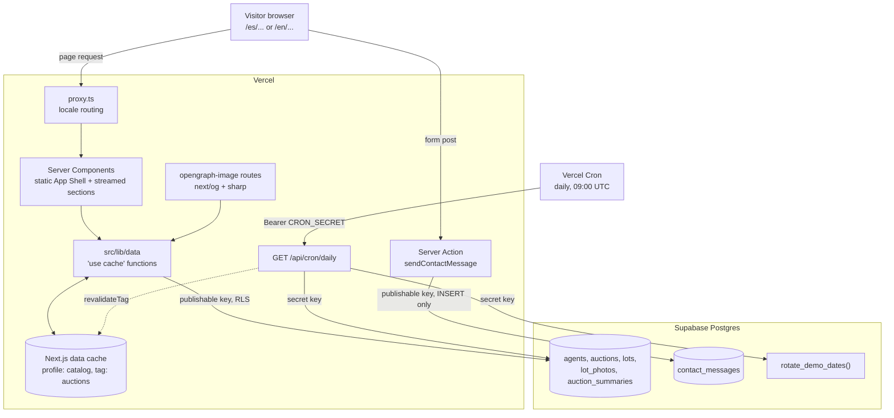
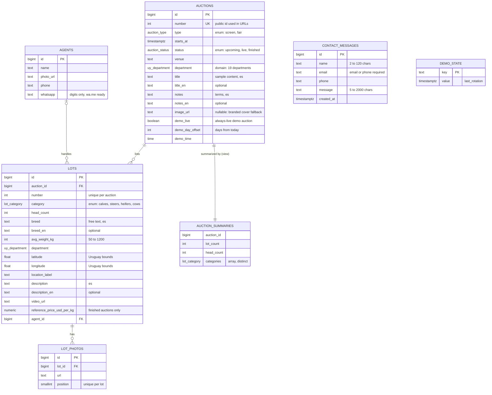
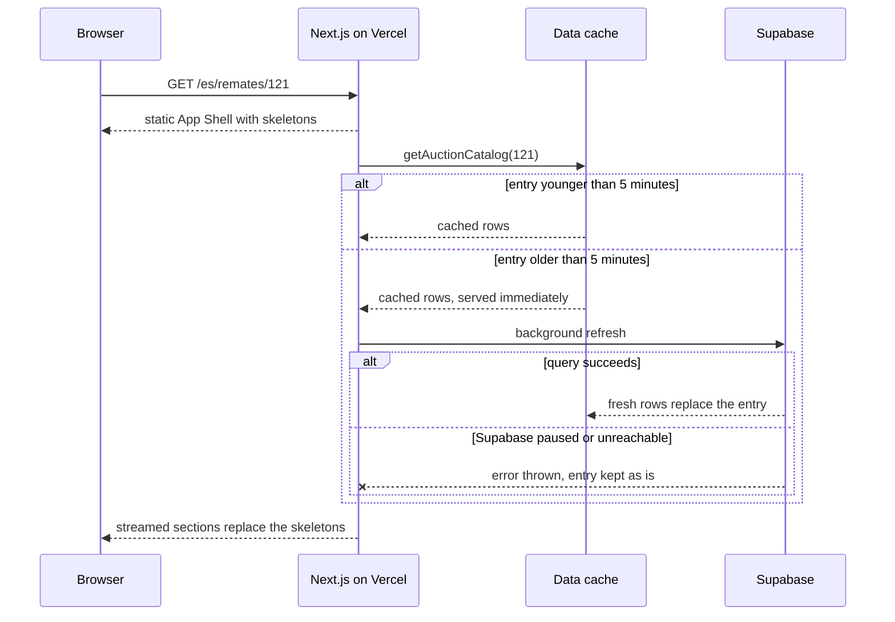
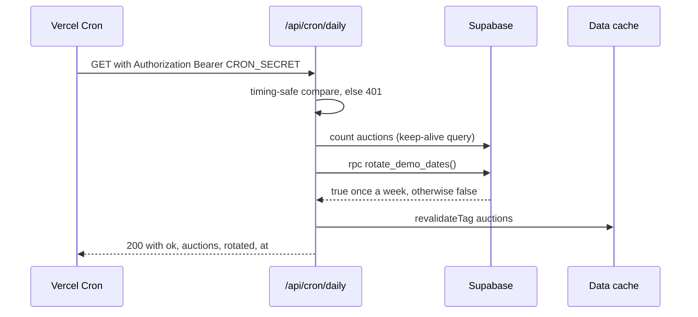

# Architecture

Technical reference for **Tranquera de Paysandú**, a bilingual (es/en) demo website for a
fictional cattle auction company in Uruguay. It covers how the system is put together and why.
For running and deploying it, see [SETUP.md](./SETUP.md); for how it was built, see
[PROCESS.md](./PROCESS.md).

- [Overview](#overview)
- [Data model](#data-model)
- [Internationalization](#internationalization)
- [Caching and resilience](#caching-and-resilience)
- [Demo mechanics](#demo-mechanics)
- [Security](#security)
- [Performance and accessibility](#performance-and-accessibility)
- [Known limitations and next steps](#known-limitations-and-next-steps)

## Overview

| Layer     | Choice                                                                                                       |
| --------- | ------------------------------------------------------------------------------------------------------------ |
| Framework | Next.js 16.4 (App Router, Turbopack, `cacheComponents`, `partialPrefetching`), React 19.3, TypeScript strict |
| Styling   | Tailwind CSS v4 with design tokens in `src/app/globals.css` (no config file)                                 |
| i18n      | next-intl 4 with localized pathnames; locale read through `next/root-params`                                 |
| Data      | Supabase Postgres (free cloud project), schema in SQL migrations, data in an idempotent seed                 |
| Maps      | Leaflet + OpenStreetMap tiles, loaded on the client when the map scrolls into view                           |
| Hosting   | Vercel Hobby, Git integration, one daily cron                                                                |

The site is read-mostly: visitors browse auctions and lots; the only write is the contact form.
There are no user accounts. Every page is rendered on the server; client components are small
leaves (language switcher, countdown, filter sheet, gallery, map, share button, live tracker,
floating WhatsApp button).



Key rules that hold across the codebase:

- **Pages never query Supabase.** They call functions in `src/lib/data/`, which are
  `server-only` and the only place that builds Supabase queries.
- **Filters live in the URL** (`?category=steers&weight=300to400`): shareable, rendered on the
  server, and the back button works. Parsing and facet counts are in `src/lib/catalog-filters.ts`.
- **One cached read per dataset.** The catalog is small (5 auctions, 63 lots), so listings,
  the featured auction, facets and previous/next navigation are derived in memory from
  `getAllAuctions()` and `getLotsForAuction(id)` instead of one query per view.

### Routes

| Internal path                    | es                        | en                            |
| -------------------------------- | ------------------------- | ----------------------------- |
| `/`                              | `/es`                     | `/en`                         |
| `/auctions`                      | `/es/remates`             | `/en/auctions`                |
| `/auctions/[auction]`            | `/es/remates/121`         | `/en/auctions/121`            |
| `/auctions/[auction]/lots/[lot]` | `/es/remates/121/lotes/3` | `/en/auctions/121/lots/3`     |
| `/live`                          | `/es/en-vivo`             | `/en/live`                    |
| `/services`                      | `/es/servicios`           | `/en/services`                |
| `/services/[service]`            | `/es/servicios/ferias`    | `/en/services/saleyard-fairs` |
| `/contact`                       | `/es/contacto`            | `/en/contact`                 |

Folder names under `src/app/[locale]/` are the internal English paths; the public paths come
from `pathnames` in `src/i18n/routing.ts`. Also generated: `sitemap.xml`, `robots.txt`, and an
Open Graph image per locale, auction and lot.

## Data model



Schema history lives in `supabase/migrations/` (seven migrations); generated types in
`src/lib/supabase/database.types.ts` (`npm run db:types`, never edited by hand).

### Decisions

**Enums store English keys.** `auction_type`, `auction_status` and `lot_category` are Postgres
enums with English values (`screen`, `steers`...). The database is language-neutral; the UI
renders them through messages (`t("lotCategory.steers")` → "Novillos" / "Steers"). The same keys
are used as query-string values, so a filtered URL is identical in both locales and the language
switcher can copy it as-is. Postgres rejects invalid values, and the generated types turn them
into TypeScript unions.

**Breed is free text, department is a constrained domain.** Breeds and crosses vary too much for
an enum (Hereford, Braford, "Cruza británica"...), so `breed` is text with an optional
`breed_en`, filled only where the English name differs (Holando → Holstein, Cruza británica →
British cross). Departments, by contrast, are a closed list: `uy_department` is a domain with a
`CHECK` on the 19 Uruguayan departments. They are proper nouns, shown unchanged in both locales,
and drive the catalog's department filter. A lot has its own department and coordinates,
separate from the auction venue, because a screen auction sells cattle from farms across the
country. Coordinates are checked against Uruguay's bounding box, and the lot map draws a 2.5 km
circle over the approximate area instead of pinning a farm.

**A summary view instead of stored counters.** Cards and headers need lots, heads and categories
per auction. `auction_summaries` computes them with one `GROUP BY`, so there are no counters to
keep in sync when lots change. It is created `with (security_invoker = true)`, so the lots' RLS
policies still apply to whoever queries the view.

**Numbers in URLs, never ids.** Auctions are addressed by `number` (`/es/remates/121`), and lots
by their position in the catalog (`/lotes/3`, unique per auction). That matches how the trade
refers to them ("Remate N.º 121, lote 3"), keeps URLs short and readable, and keeps them stable:
the seed truncates and reloads the tables, so identity ids change on every reset, but numbers do
not. Shared links and the sitemap survive a demo reset.

**Services live in code, not in the database.** The seven services are fixed institutional
content with no admin to edit them. Each one needs translated texts, a slug per locale and, for
the two auction services, the auction type they list. `src/lib/services.ts` holds the config;
texts live in `messages/{es,en}.json` next to the rest of the UI, where the i18n checks cover
them. A table would add a query and a translation scheme for content that only changes with a
deploy anyway.

**Stored status plus a computed one.** The UI never shows the raw `status`. `effectiveStatus()`
(`src/lib/data/status.ts`) treats a stored `finished` as final and otherwise derives the status
from the start time (live for 5 hours after it starts). An unattended demo never shows a past
auction as "upcoming".

**Sample content columns are optional.** `title_en`, `notes_en`, `description_en` and `breed_en`
were added as nullable columns because production reads the same database: the migration
went in first, then the seed, then the code that reads them. The site kept working at each step.

## Internationalization

**Translated routes.** `localePrefix: "always"` gives every URL a `/es` or `/en` prefix, and
`pathnames` maps each internal route to its public path per locale. `proxy.ts` (Next 16's
replacement for middleware) runs next-intl's locale routing; its matcher skips `api`, `_next`,
`_vercel` and files with an extension. Links always use `Link` from `@/i18n/navigation` with the
internal path, so a route is renamed in one place.

**Per-locale service slugs.** `/es/servicios/remates-por-pantalla` ↔
`/en/services/screen-auctions`. Each service declares both slugs; a slug from the other locale
redirects to the right one, and `translateServiceSlug()` lets the switcher map between them.

**The language switcher keeps the page.** It keeps the current route, its params and its query
string, translating only the service slug. Because filter keys and values are language-neutral,
`/es/remates/121?category=cows` becomes `/en/auctions/121?category=cows`.

**Interface vs. content.** The interface (menus, labels, headings, metadata, enum values) lives in
`messages/es.json` and `messages/en.json`, 322 keys each. Sample content (auction name and terms,
lot description and breed) lives in the database with optional English columns. The data layer
returns it as `Localized = { es: string; en: string | null }` (`src/lib/localized.ts`), and
components render it with `useLocalized()` or `pickLocalized()`, falling back to Spanish when the
English value is missing. Venues, places, departments and people's names stay as they are.

**Dates, numbers and prices.** All formatting goes through next-intl (`useFormatter` /
`getFormatter`) with named formats in `src/i18n/formats.ts` (`day`, `monthShort`, `long`,
`time`, `price`...). The request config pins `timeZone: "America/Montevideo"`, so a 10:00
auction reads 10:00 whatever the server's or visitor's time zone. The same zone is used where
dates are computed outside next-intl ("today" checks, the live demo's 2-hour blocks, the SQL date
rotation). Prices are always in US$, with locale-specific number formatting: `US$ 3,45/kg` in
Spanish, `US$3.45/kg` in English.

**SEO per locale.** Every page sets canonical and `hreflang` alternates for es, en and
`x-default` (`alternatesFor()` in `src/lib/seo.ts`); the sitemap lists both locales.

**Automated checks.** Two checks keep untranslated text out:

- **ESLint** (`eslint.config.mjs`): `react/jsx-no-literals` fails on any string literal in JSX,
  except an allow-list of symbols (`·`, `—`, `×`, `US$`...). A `no-restricted-syntax` rule also
  catches literal text in `alt`, `title`, `placeholder`, `aria-label` and `aria-description`.
- **`npm run check:i18n`** (`scripts/check-i18n.mjs`): every locale must have exactly the keys
  of `es.json` (no missing or extra keys), no empty values, and the same top-level ICU arguments
  per message (`{count}`, `{date}`...), so a translation cannot drop a placeholder.

Both run in `npm run check`, together with `tsc`.

## Caching and resilience

### `"use cache"` data functions

Every Supabase read is a `"use cache"` function with `cacheLife("catalog")` and
`cacheTag("auctions")`. The profile is defined in `next.config.ts`:

| Setting      | Value   | Effect                                                                   |
| ------------ | ------- | ------------------------------------------------------------------------ |
| `stale`      | 60 s    | how long the client router reuses data without asking the server         |
| `revalidate` | 5 min   | after this, the next request gets the cached copy and triggers a refresh |
| `expire`     | 30 days | after this without a successful refresh, the entry is dropped            |

Anything that depends on the current time is either computed inside the cached read (`status`,
`startsToday`, the live demo's start) or rendered on the client after mount (countdown, lot in the
ring). The prerendered HTML never depends on the clock.

### The App Shell rule (Next 16 Partial Prefetching)

With `partialPrefetching`, Next prerenders a static **App Shell** for each route and streams the
rest. In Next 16.4, `next dev` reported `URL data outside of Suspense` on the home, auction, lot
and live pages. Test pages showed the cause: reading the `[locale]` root param alone did not
trigger it, but any `"use cache"` call under that root param did, even a trivial one, because
its cache key includes the locale and counts as URL data.

The fix was the streaming approach, not opting out (`instant = false` is not used anywhere):
pages are synchronous and render the static frame (headings, services, contact section), while
every section that reads params, search params or cached data is an async child inside
`<Suspense>`. Fallbacks come from `components/ui/Skeleton.tsx` and mirror the real cards, so the
layout does not shift when data arrives (CLS is 0 on all measured pages).

```tsx
// src/app/[locale]/page.tsx (abridged)
export default function HomePage() {
  return (
    <>
      <HomeHero>
        <Suspense fallback={<FeaturedAuctionSkeleton />}>
          <Featured /> {/* async: reads getAuctions() */}
        </Suspense>
      </HomeHero>
      <ServicesSection /> {/* static: part of the App Shell */}
      ...
    </>
  );
}
```

### Throw, don't cache failures

Data functions **throw** on any query error instead of returning `[]` or `null`:

```ts
if (auctions.error) throw new Error(`Loading auctions failed: ${auctions.error.message}`);
```

A thrown error is never stored in the cache. When a background refresh fails, the previous good
entry stays and keeps being served. Returning empty data would cache an empty catalog for 5
minutes and show "no upcoming auctions" during a short outage. Throwing means a Supabase outage
or a paused free project is invisible to visitors for up to 30 days. Only if there is no cached
copy at all does `app/[locale]/error.tsx` show a translated "try again" page with the WhatsApp
contact.



**Verified:** with a local production build (`next build && next start`) and `SUPABASE_URL`
pointed at an unreachable host, the home, an auction, a filtered catalog and the live page kept
returning full content in two rounds of requests, the second after the 5-minute window. The
failed refreshes showed up in the server log. This was not repeated against the production
deployment.

The daily cron calls `revalidateTag("auctions", "max")`, which marks entries stale (the next visit
gets the cached copy and refreshes it) rather than deleting them, so even the cron cannot empty the
cache.

## Demo mechanics

A portfolio demo is visited at random times, often weeks apart. Four mechanisms keep it looking
current without anyone touching it.

### A permanent live auction

Auction 120 is flagged `demo_live`. Its stored date is ignored: `mapAuction()` sets its start to
the beginning of the current 2-hour block in Montevideo time (`demoLiveStart(now)` in
`src/lib/live.ts`) and forces status `live`. Because the start is a pure function of the clock,
there is nothing to schedule. Any request at any hour sees it on air, the home page features it,
and its "Ver en vivo" button leads to the `/live` page (a looping, credited stock video
standing in for the broadcast).

A cron could not do this: Hobby crons run once a day, and a cached page would show a stale
"live" auction anyway.

### "In the ring now", computed in the browser

The live page lists the auction's lots, and `LiveLotTracker` (a client component) shows which one
is in the ring, with progress ("Lote 5 de 8") and a highlight on that card (`aria-current`).
After mount, and every 15 seconds:

```ts
const start = demo ? demoLiveStart(now) : new Date(startsAt).getTime();
const duration = demo ? DEMO_LIVE_CYCLE_MS : LIVE_WINDOW_MS; // 2 h for the demo
const index = lotIndexAt(start, now, lots.length, duration); // floor(elapsed / duration × total)
```

The demo's 8 lots are spread over the 2-hour block, about 15 minutes each. The server and the
browser use the same function, so the "Started at 02:00" text and the current lot stay right even
when the HTML came from a cache entry rendered hours earlier. The computation runs only after
mount, so it never causes a hydration mismatch.

### Weekly date rotation

The other auctions store where they sit relative to "today": `demo_day_offset` (e.g. −38, −10, +9,
+20 days) and `demo_time`. `rotate_demo_dates()` is a SQL function that, when the last rotation
in `demo_state` is 7 or more days old, recomputes `starts_at` from today's date in Montevideo and
sets `finished` or `upcoming` accordingly. Upcoming offsets are kept above 7 days so an auction
never slides into the past between rotations. Between rotations, `effectiveStatus()` covers any
auction whose start time passes.

### Supabase keep-alive

The free Supabase plan pauses a project after a week without activity. One Vercel cron (Hobby
allows one run per day) covers both jobs:



If the database is unreachable the route answers 503 and logs it. Visitors still get cached
pages (see above).

## Security

The site has no logins, so the attack surface is the public database API, the cron endpoint, the
contact form and the handling of secrets.

**Row Level Security on every table.** The catalog tables have a `select` policy for `anon` and
`authenticated`; `contact_messages` only has an `insert` policy. `demo_state` has RLS on and no
policies at all.

**Default privileges narrowed.** After the first migration, a check of the effective grants
showed that Supabase's default privileges gave `anon` and `authenticated` every table privilege
(`INSERT`, `UPDATE`, `DELETE`, `TRUNCATE`...), leaving RLS as the only barrier. Migration
`20261007000200_least_privilege_grants.sql` revokes everything and grants back only what the site
uses:

```sql
revoke all on public.agents, public.auctions, public.lots, public.lot_photos,
  public.contact_messages, public.auction_summaries from anon, authenticated;
grant select on public.agents, public.auctions, public.lots, public.lot_photos,
  public.auction_summaries to anon, authenticated;
grant insert (name, email, phone, message) on public.contact_messages to anon, authenticated;
-- Future tables start closed: grant explicitly in their migration.
alter default privileges in schema public revoke all on tables from anon, authenticated;
```

So the publishable key can read the catalog and insert into four columns of `contact_messages`.
It cannot read messages back or set `id`/`created_at`. RLS and grants are two independent
layers.

**Privileged function.** `rotate_demo_dates()` is `security definer` with a fixed
`search_path`, and `EXECUTE` is revoked from `public`, `anon` and `authenticated` and granted
only to `service_role`.

**Secrets.**

- The browser never talks to Supabase. Both clients live in `server-only` modules: the
  publishable-key client for reads and the contact action, the secret-key client
  (`src/lib/supabase/admin.ts`) only for the cron route.
- `SUPABASE_SECRET_KEY` has no `NEXT_PUBLIC_` prefix, so Next never inlines it into client code.
  After the last deploy, the built client bundles were searched for it, and it did not appear.
- Credentials live in `.env.local` (git-ignored). `.env.example` documents every variable with
  empty values. On Vercel the secret key and `CRON_SECRET` are production-only and marked
  Sensitive. The repository history was checked for secrets before the first push to GitHub.
- The `db:*` scripts load `.env.local` inside a Node wrapper (`scripts/supabase.mjs`) and call the
  Supabase CLI without a shell. Credentials are never typed on the command line or printed.

**Cron endpoint.** `/api/cron/daily` requires `Authorization: Bearer <CRON_SECRET>` (the header
Vercel Cron sends), compared with `crypto.timingSafeEqual`. A missing secret, a missing header or
a wrong value gets `401`; nothing runs before the check.

**Contact form.** A Server Action (`src/app/actions/contact.ts`) validates on the server with the
same rules as the table's `CHECK` constraints:

- name of 2–120 characters;
- email or phone, at least one;
- email and phone formats;
- message of 5–2000 characters.

Errors come back as message keys, so the client shows them translated. A hidden honeypot field
silently drops bot submissions. The browser only adds native hints (`required`, `type="email"`,
`type="tel"`). The server is the authority, and the database constraints remain the last line of
defense. Inserts go through the
publishable key and are bound by the grants above.

**WhatsApp links** are built from fixed numbers and an encoded message that always starts with
the demo prefix (`[Demo] Tranquera de Paysandú`), so no message can look like it came from a real
business.

## Performance and accessibility

### Lighthouse (mobile)

Lighthouse 13.5, mobile form factor, simulated throttling, against production
(`tranquera-de-paysandu.vercel.app`) on 2026-10-07, two runs per page:

| Page                            | Performance | Accessibility | Best practices | SEO | LCP       | TBT   | CLS |
| ------------------------------- | ----------- | ------------- | -------------- | --- | --------- | ----- | --- |
| Home (`/es`)                    | 93–94       | 100           | 100            | 100 | 2.6–2.9 s | 70 ms | 0   |
| Schedule (`/es/remates`)        | 94          | 100           | 100            | 100 | 2.7 s     | 30 ms | 0   |
| Auction (`/es/remates/121`)     | 91          | 100           | 100            | 100 | 3.0–3.1 s | 40 ms | 0   |
| Lot (`/es/remates/121/lotes/1`) | 90–91       | 100           | 100            | 100 | 3.1 s     | 70 ms | 0   |

### What was fixed to reach the target (90+ in every category)

- **Contrast:** the `ink-subtle` token went from `#75786d` to `#61645a` to meet WCAG AA on the
  paper background.
- **Heading order:** the schedule page jumped from `h1` to card `h3`. The results count became
  an `sr-only` `h2`, which also announces the count after filtering (`aria-live`).
- **Valid definition list:** each group in the auction header's `<dl>` had an icon and a nested
  `<div>` around its `<dt>`/`<dd>`. Now each group holds exactly one `dt` + `dd`, with the icon
  inside the `dt`.
- **Render-blocking CSS:** `experimental.inlineCss` inlines the (small) Tailwind output in the
  `<head>` instead of a blocking `<link>`.
- **LCP images:** above-the-fold images (`eager` in `CoverImage`) use `quality={60}`
  (`images.qualities: [60, 75]`) and `fetchpriority="high"`; everything else is lazy at 75.
- **Already in place:**
  - every photo is a pre-optimized WebP served through `next/image` with real `sizes`;
  - videos are muted MP4s with posters: lot videos use `preload="none"`, and the live page's
    looping video (`LoopVideo`) loads lazily, pauses off-screen and does not autoplay with
    `prefers-reduced-motion`;
  - Leaflet loads only when the map scrolls into view;
  - fonts come from `next/font`.

### Where the margin is tightest

The **lot page (90–91)** and the **auction page (91)**. Both are bound by LCP (about 3 s under
simulated slow 4G): a large photo or, on lot 1, the video poster. Total blocking time and layout
shift are low, so further gains would come from smaller hero media on phones, e.g. a lower-quality
first photo or a smaller poster. In the production runs, Speed Index (4.0–4.5 s) was also much
higher than in local runs (about 1 s). This was not investigated further.

Accessibility work beyond Lighthouse:

- a skip link;
- visible focus styles;
- a native `<dialog>` for the filter sheet;
- `aria-current` for the active nav item and the lot in the ring;
- `aria-hidden` icons next to visible or `sr-only` text;
- `aria-live` on result counts and the live panel.

## Known limitations and next steps

### Limitations

- **No admin panel.** Content is managed through SQL migrations and `supabase/seed.sql`;
  changing an auction means a seed run or a manual edit in Supabase.
- **The live broadcast is simulated.** The video is stock footage and the lot in the ring is
  computed from the clock. There is no real-time channel.
- **One shared database.** Development and production use the same Supabase project, so schema
  changes must be backward compatible (optional columns first, code after). There is no staging
  database.
- **Contact messages are stored, not delivered.** Nobody is notified of a new message, and there
  is no rate limiting beyond the honeypot.
- **No automated test suite.** Verification is the type check, lint, i18n check, production build
  and manual review of screenshots in both locales, at 375 px and desktop.
- **Daily-only cron.** On Hobby the job may run at any time within its hour, and a failed run is
  only retried the next day. The 30-day cache expiry and the 7-day pause window leave a wide
  margin.
- **Public OpenStreetMap tiles** are fine for a demo but not for real traffic; a tile provider
  with an API key would be needed.

### Next steps

- **Admin panel:** Supabase Auth for staff, write policies scoped to an `authenticated` staff
  role, and forms that reuse the validation and enum keys already in place. A save would call
  `revalidateTag("auctions")` so changes show immediately.
- **Real-time pre-bids:** requires accounts (bidders must be identified). Supabase Realtime on a
  `bids` table with RLS (each bidder sees only their own bids, the highest bid is public), plus
  server-side validation of bid increments. The live tracker would read the real lot instead of
  the clock.
- **Excel import:** auction houses keep catalogs in spreadsheets. An upload in the admin panel
  would parse the file, validate each row against the same constraints (categories, departments,
  weights, coordinates) and upsert by auction and lot number, which are already the stable keys.
- **Automatic flyers:** each auction's Open Graph image is already generated from data with
  `next/og`, the brand fonts and `sharp`. The same pipeline could render shareable flyers (square
  for WhatsApp status, A4 PDF for print) listing the lots of an auction.
- **Engineering:**
  - Playwright tests for the critical paths (filters, language switch, contact form);
  - a separate Supabase project for previews;
  - Lighthouse CI on pull requests.
